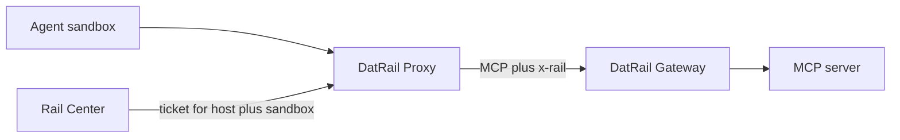

# DatRail Proxy

DatRail Proxy is the injection point in the open-source DatRail request path.
It stands between an AI agent and its MCP servers, fetches an `x-rail` ticket
for the configured host and sandbox, and attaches that ticket to forwarded
calls without exposing it to the agent.

## Quick start

Create a bridge configuration from
[`fastmcp_proxy/bridge.yaml.example`](fastmcp_proxy/bridge.yaml.example), then
run in forwarding-only mode:

```bash
git clone https://github.com/datrail/proxy.git
cd proxy
cp fastmcp_proxy/bridge.yaml.example bridge.yaml
docker run --rm -p 8091:8091 \
  -v "$PWD/bridge.yaml:/app/fastmcp_proxy/bridge.yaml:ro" \
  -e RAIL_TICKET_MODE=none \
  ghcr.io/datrail/proxy:latest
```

To attach an identity, add `RAIL_CENTER_URL`, `RAIL_HOST_ID`, and
`RAIL_SANDBOX_NAME`; [`.env.example`](.env.example) documents all environment
variables. The proxy serves MCP at `POST /mcp` and liveness at `GET /health`.

## Architecture



Agent-supplied headers do not cross the proxy boundary. In `observe` or
`enforce` mode, the proxy fetches and refreshes its own ticket; if no valid
ticket is available it forwards no identity and sets an `x-rail-status` reason.
The fetch response is defined by [`spec/ticket-fetch.schema.json`](spec/ticket-fetch.schema.json).

## Security

An `x-rail` ticket is a bearer credential. Do not log it, expose it to the
sandbox, follow redirects while carrying it, or send control-plane credentials
over plaintext except in an explicitly configured local development setup.
Read [SECURITY.md](SECURITY.md) and report vulnerabilities privately through
GitHub Security Advisories.

## Development

```bash
python -m venv .venv
. .venv/bin/activate
pip install -r requirements-test.txt -r requirements-dev.txt
make test
make lint
docker compose -f e2e/compose.yml up --build \
  --abort-on-container-exit --exit-code-from driver
```

## Related projects

- [DatRail Gateway](https://github.com/datrail/gateway) enforces policy.
- [RailMon](https://github.com/datrail/railmon) observes agent traffic.
- [RailDash](https://github.com/datrail/raildash) presents captures locally.

## License

Apache-2.0. See [LICENSE](LICENSE) and [NOTICE](NOTICE).
