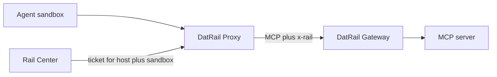

# DatRail Proxy

DatRail Proxy is the injection point in the open-source DatRail request path.
It stands between an AI agent and its MCP servers, fetches an `x-rail` ticket
for the configured host and sandbox, and attaches that ticket to forwarded
calls without exposing it to the agent.

It comes in two forms:

- [proxy-standalone](proxy-standalone/README.md): an MCP proxy the agent
  connects to.
- [proxy-envoy-grpc](proxy-envoy-grpc/README.md): a service that Envoy calls
  to add the ticket to the agent's own HTTP requests.

## Quick start

Run it in forwarding-only mode, with the example bridge configuration:

```bash
git clone https://github.com/datrail/proxy.git
cd proxy
cp proxy-standalone/bridge.yaml.example bridge.yaml
docker run --rm -p 8091:8091 \
  -v "$PWD/bridge.yaml:/app/standalone/bridge.yaml:ro" \
  ghcr.io/datrail/proxy:latest
```

To attach an identity, and for the full configuration, see
[proxy-standalone](proxy-standalone/README.md).

## Architecture


```mermaid
flowchart LR
  agent[Agent sandbox] --> proxy[DatRail Proxy]
  center[Rail Center] -->|ticket for host plus sandbox| proxy
  proxy -->|MCP plus x-rail| gateway[DatRail Gateway]
  gateway --> server[MCP server]
```

With `RAIL_PLUGIN_ENABLED=true` the proxy fetches and refreshes its own ticket;
if no valid ticket is available it forwards no identity and sets an
`x-rail-status` reason. An `x-rail` header the agent supplies never crosses.

The two forms differ in what else crosses. proxy-standalone makes every call to
the upstream itself, so none of the agent's headers reach it. proxy-envoy-grpc
changes the agent's own request, so the agent's other headers reach the
upstream as sent; only its `x-rail` headers, and any with `_` in the name, are
removed, and only protected hosts get the ticket. The fetch response is defined by
[`spec/ticket-fetch.schema.json`](spec/ticket-fetch.schema.json).

The proxy and [DatRail Gateway](https://github.com/datrail/gateway) have
separate, responsibility-specific cores: the proxy obtains and injects an opaque
ticket, the gateway parses it and makes an enforcement decision. They share no
runtime library, and their only shared boundary is the `x-rail` wire contract,
which keeps the proxy from learning claims it must treat as opaque.

The proxy targets `x-rail` `v1.0`, at `datrail/x-rail-spec` commit
`1282f71495d9b585b6562255f5194f0754e3d586`. A wire change lands in
x-rail-spec first, under a new version; the proxy and the gateway then update
this pin and their conformance tests. The proxy's release versions do not
version the wire contract.

## Layout

Each part is its own package in one [uv workspace](https://docs.astral.sh/uv/concepts/projects/workspaces/),
with one `uv.lock` pinning every dependency, and each image installs only the
packages it runs:

| Package | Import | What it holds |
|---|---|---|
| [proxy-core](proxy-core/README.md) | `proxy.core` | ticket lifecycle and byte-for-byte `x-rail` injection |
| [proxy-standalone](proxy-standalone/README.md) | `proxy.standalone` | FastMCP host, process configuration and bridge file; its Dockerfile builds `ghcr.io/datrail/proxy` |
| [proxy-envoy-grpc](proxy-envoy-grpc/README.md) | `proxy.envoy_grpc` | the service Envoy calls on each request, its settings and the reference Envoy config |

Dependencies point one way: every interface imports the vendor-neutral core,
and the core imports no interface. More generally, a package imports only the
packages its `pyproject.toml` declares, and
[`test_architecture.py`](proxy-core/tests/test_architecture.py) enforces it.

A new interface is a `proxy-<name>/` package importing as `proxy.<name>`,
with its own Dockerfile and image. Name it after its extension mechanism, not a
cloud vendor (`proxy-envoy-grpc`, not `proxy-gcp`), so one implementation can
serve every platform that speaks that mechanism.

## Security

An `x-rail` ticket is a bearer credential. Do not log it, expose it to the
sandbox, follow redirects while carrying it, or send control-plane credentials
over plaintext except in an explicitly configured local development setup.
Read [SECURITY.md](SECURITY.md) and report vulnerabilities privately through
GitHub Security Advisories.

## Development

Requires [uv](https://docs.astral.sh/uv/), which also installs the Python
version in `.python-version`.

```bash
make init    # uv sync: every member, editable, plus the pinned dev tools
make test
make lint    # `make fmt` formats and fixes instead of only checking
make e2e     # each image against a stubbed Rail Center and upstream; see e2e/README.md
```

## Related projects

- [datrail-project](https://github.com/datrail/datrail-project#readme) is the
  entry point to DatRail: how the components fit together, and a quick start for
  RailMon and RailDash. The
  [DatRail glossary](https://github.com/datrail/datrail-project/blob/master/docs/glossary.md)
  defines the terms they share.
- [DatRail Gateway](https://github.com/datrail/gateway) enforces policy.
- [RailMon](https://github.com/datrail/railmon) observes agent traffic.
- [RailDash](https://github.com/datrail/raildash) presents captures locally.

## License

Apache-2.0. See [LICENSE](LICENSE) and [NOTICE](NOTICE).
