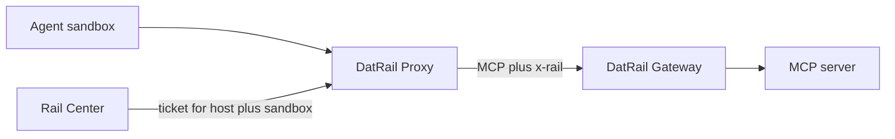

# DatRail Proxy

DatRail Proxy is the injection point in the open-source DatRail request path.
It stands between an AI agent and its MCP servers, fetches an `x-rail` ticket
for the configured host and sandbox, and attaches that ticket to forwarded
calls without exposing it to the agent.

## Quick start

Create a bridge configuration from
[`standalone/bridge.yaml.example`](standalone/bridge.yaml.example), then
run in forwarding-only mode:

```bash
git clone https://github.com/datrail/proxy.git
cd proxy
cp standalone/bridge.yaml.example bridge.yaml
docker run --rm -p 8091:8091 \
  -v "$PWD/bridge.yaml:/app/standalone/bridge.yaml:ro" \
  ghcr.io/datrail/proxy:latest
```

That is the whole of forwarding-only: `RAIL_PLUGIN_ENABLED` is off by default,
so a proxy nobody has given RailXia configuration needs no variable at all.

To attach an identity, set `RAIL_PLUGIN_ENABLED=true` and add
`RAIL_CENTER_URL`, `RAIL_HOST_ID`, and `RAIL_SANDBOX_NAME` — those three beside
a plugin that is off is refused at startup, so a deployment cannot lose the flag
by itself and quietly stop attaching. Losing the whole block at once still can:
an env file that fails to mount takes the flag and the three with it, and the
proxy comes up as a plain proxy, saying so at INFO. Watch that the variables
arrive, not just that the container is healthy. [`.env.example`](.env.example) documents all
environment variables. The proxy serves MCP at `POST /mcp` and liveness at `GET /health`.

## Architecture

The repository has one dependency direction: the standalone host imports the
vendor-neutral injection core. The core never imports the host or a future
plugin. [`docs/layout.md`](docs/layout.md) records the layout decisions shared
with DatRail Gateway.

```text
core/        ticket lifecycle and byte-for-byte x-rail injection
standalone/  FastMCP host, process configuration, and bridge file
```


```mermaid
flowchart LR
  agent[Agent sandbox] --> proxy[DatRail Proxy]
  center[Rail Center] -->|ticket for host plus sandbox| proxy
  proxy -->|MCP plus x-rail| gateway[DatRail Gateway]
  gateway --> server[MCP server]
```

Agent-supplied headers do not cross the proxy boundary. With
`RAIL_PLUGIN_ENABLED=true` the proxy fetches and refreshes its own ticket; if no
valid ticket is available it forwards no identity and sets an `x-rail-status`
reason. The fetch response is defined by
[`spec/ticket-fetch.schema.json`](spec/ticket-fetch.schema.json).

## Security

An `x-rail` ticket is a bearer credential. Do not log it, expose it to the
sandbox, follow redirects while carrying it, or send control-plane credentials
over plaintext except in an explicitly configured local development setup.
Read [SECURITY.md](SECURITY.md) and report vulnerabilities privately through
GitHub Security Advisories.

## Development

```bash
python -m venv .venv
. .venv/bin/activate
pip install -r requirements-test.txt -r requirements-dev.txt
make test
make lint
docker compose -f e2e/compose.yml up --build \
  --abort-on-container-exit --exit-code-from driver
```

## Related projects

- [DatRail Gateway](https://github.com/datrail/gateway) enforces policy.
- [RailMon](https://github.com/datrail/railmon) observes agent traffic.
- [RailDash](https://github.com/datrail/raildash) presents captures locally.

## License

Apache-2.0. See [LICENSE](LICENSE) and [NOTICE](NOTICE).
