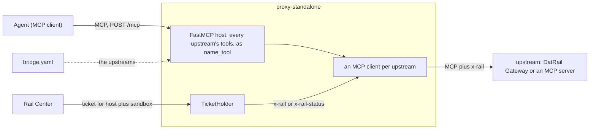

# proxy-standalone

`proxy.standalone`, the FastMCP host that runs
[proxy-core](../proxy-core/README.md) between an agent and its MCP servers:
process configuration, the bridge file, and the HTTP server. Its Dockerfile
builds `ghcr.io/datrail/proxy`. See the [main README](../README.md) for the
whole.

## Architecture



The agent speaks MCP to the proxy, and the proxy's own MCP clients make every
call upstream. Nothing of the agent's request crosses but the call itself:

- **None of the agent's headers** reach an upstream, `x-rail` and
  `Authorization` included. What arrives is the client's own headers, plus
  `x-rail` with the ticket, or `x-rail-status` with the reason there is none,
  or neither when the plugin is off.
- **Only the bridge file's upstreams** get the ticket. Redirects are not
  followed, and no ambient proxy setting is read.
- **Startup waits for the first fetch**, bounded by
  `RAIL_PROXY_TICKET_TIMEOUT_SECONDS`, before the port is bound. A failed fetch
  doesn't stop it: calls then carry `x-rail-status`.

## Run

The main README's [quick start](../README.md#quick-start) runs the image
forwarding-only, and that is the whole of it: `RAIL_PLUGIN_ENABLED` is off by
default, so a proxy nobody has given RailXia configuration needs no variable at
all. The image has no bridge file of its own: without one mounted it stops at
startup.

To attach an identity, set `RAIL_PLUGIN_ENABLED=true` and add
`RAIL_CENTER_URL`, `RAIL_HOST_ID`, and `RAIL_SANDBOX_NAME` — those three beside
a plugin that is off is refused at startup, so a deployment cannot lose the flag
by itself and quietly stop attaching. Losing the whole block at once still can:
an env file that fails to mount takes the flag and the three with it, and the
proxy comes up as a plain proxy, saying so at INFO. Watch that the variables
arrive, not just that the container is healthy.

## Configuration

It reads the variables every interface shares: see
[proxy-core's configuration](../proxy-core/README.md#configuration).
[`.env.example`](../.env.example) lists every variable.

#### `RAIL_PROXY_CONFIG_FILE`

The bridge file: the upstream MCP servers, the one thing an environment
variable can't express. Each upstream's tools are re-exposed as
`<name>_<tool>`. Start from [`bridge.yaml.example`](bridge.yaml.example).

Required: the proxy stops at startup without one. Defaults to
`standalone/bridge.yaml`, relative to the working directory. The image sets
it to `/app/standalone/bridge.yaml` and ships no file there, so mount one.

#### `RAIL_PROXY_BIND`

The interface to listen on. Defaults to `0.0.0.0`.

#### `RAIL_PROXY_PORT`

The port to listen on. Defaults to `8091`.

#### `RAIL_PROXY_UPSTREAM_TIMEOUT_SECONDS`

How long a call waits on an upstream before the agent is told it timed out.
Defaults to `30`.

## Endpoints

- `POST /mcp`: the proxied MCP endpoint.
- `GET /health`: liveness, `200` whether or not a ticket is held, with whether
  the plugin is on and a fingerprint and expiry of what is held — never the
  ticket.

## From source

```bash
make init
cp proxy-standalone/bridge.yaml.example bridge.yaml   # then edit it
RAIL_PROXY_CONFIG_FILE=bridge.yaml uv run python -m proxy.standalone
```
